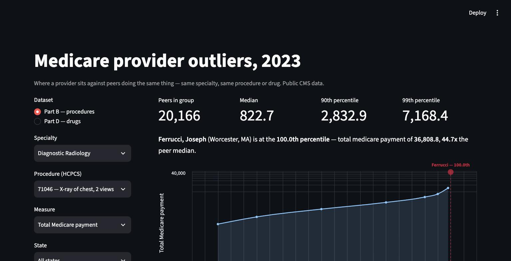

# CMS Outlier Detection

**Which Medicare providers bill unlike everyone else doing the same thing?**

Among the 20,166 radiologists who billed Medicare for a two-view chest X-ray in a facility in 2023, the median collected **$823**. One collected **$36,809** — 44.7x the median, at the 100th percentile of his peer group. Switch to the same procedure in an office setting and the 99th percentile more than doubles, from $7,168 to $18,288: where the X-ray was taken changes what "normal" means, so the two are scored as separate peer groups.

This finds those providers, on all 36.5M rows of public CMS data for 2023, and is careful about what the ranking does and does not mean.



*Running locally with the full fact layer. The hosted version serves peer distributions from a 3.3 MB table committed to this repo; provider-level drill-down needs the 941 MB build artifact and is disabled there, with a note saying so.*

## What this is

A portfolio project built on public CMS (Centers for Medicare & Medicaid Services) data, aimed at healthcare and medtech-adjacent roles. It has two parts:

1. **SQL / data engineering** — real multi-table joins (providers, claims, drug/procedure reference data, geography), window functions for peer-relative outlier scoring, and a documented query optimization case study: *interactive percentiles over 36M rows, served from free-tier hosting*. Two paths, measured separately — the **serving** path, where a precomputed peer-statistics table replaces a live percentile scan, and the **drill-down** path, where the app reads remote Parquet over HTTP range requests and sort order, zone-map pruning and projection pushdown decide how many bytes come down the wire.
2. **Streamlit app** — one screen: pick a specialty and a procedure or drug, see the peer-group distribution with a chosen provider marked on it, filter by state, and read what CMS censored out of the picture.

## Status

Full 2023 data pulled locally (9,660,647 rows / 2.9 GB for Part B, 26,794,878 rows / 3.6 GB for Part D) and explored end to end. Engine and storage format decided, schema designed, and the whole model now builds from the raw CSV with its integrity checks passing: 36.5M fact rows carrying precomputed peer ranks in 941 MB of Parquet, plus a 3.3 MB peer-statistics table that ships in the repo and answers the app's main query without touching the facts. The levers are measured in [notebook 03](notebooks/03_optimization.ipynb), reading the facts over a real HTTP server that counts bytes. The screen runs locally against those artifacts. Next: LICENSE and attribution, an interpretation-and-limits section, and deploying.

Decisions and findings so far:

- **[ADR 0001](docs/adr/0001-duckdb-parquet-storage.md)** — DuckDB as the engine of record over Hive-partitioned Parquet, with a precomputed peer-statistics table as the serving layer. Includes the PostgreSQL alternative and why it was rejected, plus dated amendments recording what the measurements later changed.
- **[docs/schema.md](docs/schema.md)** — star schema, natural keys, peer-group definitions, and the two datasets' very different suppression rules.
- **[docs/build_report.md](docs/build_report.md)** — generated by the build: artifact sizes, per-column footprint, and every integrity check with its result. The build regenerates it, so no number in it is typed by hand.
- **[notebooks/02_distributions.ipynb](notebooks/02_distributions.ipynb)** — the measurements everything above rests on: value distributions, peer-group sizes, cardinality, and data-quality findings across all 36M rows.
- **[notebooks/03_optimization.ipynb](notebooks/03_optimization.ipynb)** — the optimization levers, measured. Sorting by the peer key cuts bytes over HTTP by **26x** against the same data unsorted; projection pushdown cuts another **3.6x**; the precomputed `peer_stats` answers the app's main question **23.8x faster** than computing it over the remote facts.

Three findings that shaped the design:

- Peer groups are tiny — median 4 rows (Part B) and 5 (Part D). Requiring at least 30 peers before scoring a provider excludes 77.9% of Part B peer groups but only **2.40% of rows**, so statistical honesty is nearly free here.
- The measures are heavy-tailed enough that mean and standard deviation are unusable: `mean/median` reaches 12.7 for Part D cost-per-claim. Scoring uses percentile rank instead.
- The two datasets censor small counts differently. Part D blanks a column — `Tot_Benes` is null on **55.08%** of rows. Part B removes the row entirely, so its censoring produces no nulls at all and is invisible unless you go looking for it.

## The thing worth knowing about this data

Both datasets hide small counts to protect patient privacy, and they do it in opposite ways.

**Part D blanks a column.** `Tot_Benes` is null on **55.08%** of rows — and not at random: it
is systematically the small prescriber-drug pairs. So any per-beneficiary metric silently
deletes the bottom half of the distribution while looking like it describes all of it. This
project scores Part D on claims and cost only, for that reason.

**Part B deletes the row.** Measured: `min(tot_benes)` is exactly 11 with zero rows below,
and the low end runs 477,670 rows at 11, then 423,446, then 380,812 — monotonically
decreasing. A natural distribution rises toward its low end; this one peaks at the threshold
and stops, because it has been cut.

The consequence is that **Part B's censoring is invisible.** It produces no nulls at all. A
provider who performs a procedure eight times does not appear as missing data — they appear
as a provider who does not perform it. Every Part B percentile in this project is therefore
a rank against the providers who survived suppression, which the app states on screen rather
than in a footnote.

## Project structure

```
pyproject.toml, uv.lock      Python project managed with uv
docs/
  adr/                       architecture decision records
  schema.md                  data model: tables, keys, peer groups, suppression rules
  build_report.md            generated by the build: sizes, footprint, check results
  optimization.md            (planned) the query optimization writeup
src/cms_outliers/
  data/                      dataset catalog lookup + sample and full pull scripts
  sql/build.py               runs the SQL below: CSV -> typed, sorted Parquet
  measure.py                 counts bytes DuckDB fetches over HTTP range requests
  app/main.py                the one screen (Streamlit)
  app/queries.py             the screen's SQL, runnable without a browser
sql/
  build/                     the data model, one .sql file per table
  checks/                    grain and agreement assertions, run on every build
data/
  raw/                       full bulk downloads — gitignored; re-pull with pull_full.py
  samples/                   small committed samples for exploration/dev
  parquet/                   built fact + dimension layer — gitignored, goes out as a Release asset
  serving/                   built peer_stats — committed, this is what the app reads
notebooks/
  01_explore_samples.ipynb   columns, cardinality and quirks, on the 5k samples
  02_distributions.ipynb     distributions, peer-group sizes and data quality, full data
  03_optimization.ipynb      the levers, measured — bytes over HTTP and query timings
tests/
```

## Running it

The hosted version needs no setup. To run the full screen, including provider drill-down:

```bash
uv sync
uv run python -m cms_outliers.data.pull_full --dataset part_b --year 2023   # 2.9 GB
uv run python -m cms_outliers.data.pull_full --dataset part_d --year 2023   # 3.6 GB
uv run python -m cms_outliers.sql.build --year 2023                        # ~1 min
uv run streamlit run src/cms_outliers/app/main.py
```

`peer_stats` is already in the repo, so the app's distributions work off a fresh clone. The
two pulls and the build are what the provider-level drill-down needs. To check the model
without downloading 6.5 GB, build against the committed 5k samples instead:

```bash
uv run python -m cms_outliers.sql.build --year 2023 --source samples
```

`streamlit_app.py` at the repository root exists for Streamlit Community Cloud, which runs
from the root and installs with pip (`requirements.txt`) rather than uv. It is a three-line
shim over `src/cms_outliers/app/main.py`, which is the real code.

## Data source

Public CMS data (data.cms.gov): the **Medicare Physician & Other Practitioners by Provider and Service** (Part B) and **Medicare Part D Prescribers by Provider and Drug** datasets. Full details on structure, download process, and the columns in each — see `data/Data.md`.
